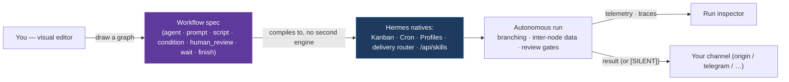

# Hermes Workflows

> Multi-step automations for [Hermes Agent](https://github.com/NousResearch/hermes-agent) — drawn as a graph, run on Hermes' own primitives, with a human in the loop only where you put one.

Hermes Workflows is a dashboard plugin for Hermes Agent. You draw an automation as a graph — agent
tasks, shell steps, branches, and review gates — and it runs on top of Hermes' own Kanban, Cron,
and Profiles. It is not a second engine: every node compiles to a native Hermes primitive, so a
workflow is something you can read, schedule, and reason about with the tools Hermes already gives
you. Where a single scheduled prompt (an [Automation Blueprint](#workflows-vs-automation-blueprints))
isn't enough, a workflow is the layer above it.

Hermes Workflows now supports release-oriented runs that resume failed runs, export portable template bundles, and drive adopted board cards one at a time on a shared feature branch so cross-card context stays intact while docs and version updates happen once for the whole scope.

## Why

- **It runs itself.** Hermes Workflows advances the run as soon as a workflow card finishes. Native Kanban lifecycle hooks move card-driven nodes forward in seconds, while the configurable self-terminating cron tick stays as the safety net and `wait`-node poll.
- **Nothing is locked away.** A workflow is a plain spec you export to YAML/JSON, re-import on a
  clean install, and edit by hand or in the visual editor. Data flows between nodes through the run
  state, not a host file path baked into the graph — so it stays portable.
- **It speaks Hermes, not a private dialect.** Nodes become native Kanban cards, Cron jobs, and
  Profile assignments; results deliver through the host's own delivery router; skills come from the
  host catalog. There is no parallel runtime to learn or trust.
- **You see what happened.** Every agent node reports live per-node telemetry (duration, tokens,
  tool calls, errors), pending dangerous-command approvals surface in the run inspector, and an
  opt-in per-run trace records the whole timeline.

## How it fits



## What you get

- **A visual authoring lifecycle.** Create a workflow from a modal, grow the graph in an
  `@xyflow/react` editor (edit every node field, duplicate, auto-layout), validate, preview the
  compiled Hermes plan, then press **Play** to run it in place — the canvas shows live per-node
  progress and hands off to the run inspector when it settles.
- **Seven node types.** `agent_task` (a prompt assigned to a profile, with a per-node model and
  skills picked from the host `/api/skills` catalog), `prompt` (a block of authored text layered
  above a downstream `agent_task` as its primary instruction), `script` (a deterministic shell
  step, gated by an enable flag and an env allowlist), `condition` (branch on a node's outcome or
  a review decision), `human_review` (pause for a channel-agnostic decision), `wait` (a worker-free
  wait for an external signal, e.g. a merged PR), and `finish`.
- **Triggers.** `manual`, `cron`, or an event trigger (`webhook` / `github` / `api`) — see
  [the schema doc](docs/workflow-schema.md#triggers) for the current support boundary.
- **Inter-node data flow.** A node consumes a prior node's output via
  `input_mapping: { x: "{{nodes.<id>.output}}" }`; the engine substitutes it at schedule time and
  fails loud if an expected output never materialised — no silent empty text.
- **First-class delivery.** A workflow can declare where its result is delivered (Hermes
  `DeliveryTarget` syntax, or `origin`); a result containing `[SILENT]` suppresses delivery so
  nothing-to-say runs stay quiet.
- **Runs, Schedules, Settings.** A Runs view (open / cancel / retry / export-logs), a Schedules
  view over Hermes cron (pause / resume / run-now / edit), and a Settings view backed by the Hermes
  config. Runs are single-flight: at most one active run per workflow.

## Workflows vs Automation Blueprints

Hermes [Automation Blueprints](https://github.com/NousResearch/hermes-agent) are the single-prompt
tier: one typed-slot schema rendered natively across surfaces (dashboard form, `/blueprint` slash
command, agent-seed, `hermes://` deep-link, docs catalog), compiling to one `cron.jobs` job.
Workflows are the **multi-node layer above** them: a graph with branching, inter-node data flow, and
review gates. They are complementary — a blueprint is one prompt on a schedule, a workflow is a DAG
— and both reuse the same native primitives. On the Schedules surface, workflow-trigger cron jobs
are tagged `Workflow` so the two kinds read distinctly.

## Quick start

```bash
# Install the plugin into Hermes and restart the gateway
hermes plugins install itechmeat/hermes-workflows --enable
hermes gateway restart
```

Open the **Workflows** tab in the Hermes dashboard, create a workflow from the modal (it opens in
the editor seeded with a minimal valid graph), add nodes, set a `cron` trigger if you want it to run
on a schedule, and press **Play** to try it. Authoring, run-control, and the compile preview all
live in the dashboard — full tour in [`docs/dashboard.md`](docs/dashboard.md).

### Hermes compatibility

A node's output is captured from the worker session's final result
(`task_runs.summary` for board nodes, the oneshot `-z` final message for global /
off-board nodes). That output must survive a mid-run context auto-compression,
which rotates the session id. Run on a Hermes build that includes the
compression session-rotation fixes ([#48584](https://github.com/NousResearch/hermes-agent/pull/48584)
and [#48633](https://github.com/NousResearch/hermes-agent/pull/48633)); on an
older host a long worker that auto-compresses mid-run can drop its final turn,
and an `adopt` that depends on a final `task_ids` block would then fail closed.

## FAQ

**Is Linux required, or does Windows work too?** Hermes Workflows targets Linux
and macOS (the same as Hermes Agent). The TypeScript core (Bun) and Python bridge
are cross-platform, but the install flow and the dashboard-API sidecar service
assume a Unix shell, so on Windows run it under WSL.

**Do I need a dedicated vault?** Hermes Workflows itself stores nothing in a
vault - it is a Hermes dashboard plugin; its specs live in the workflow spec
roots and its runs in `runs.db`. A vault only matters if you also run
[Open Second Brain](https://github.com/itechmeat/open-second-brain) for memory:
there you point it at your own existing Obsidian vault and it manages a `Brain/`
subdirectory inside it - no separate "brain vault" needed.

**Do I connect to the dashboard on a different port, or through the Workflows
tab?** Through the **Workflows tab** in the Hermes dashboard (same origin). The
plugin's API runs as a separate sidecar (default `127.0.0.1:9123`) that recent
Hermes does not auto-mount for a non-bundled plugin (GHSA-5qr3-c538-wm9j), so the
dashboard host must reverse-proxy `/api/plugins/workflows/*` to it. If the tab
shows a "Could not load" panel, it explains this setup; see
[Running the backend](docs/dashboard.md#running-the-backend-standalone-sidecar).

**Does the agent name in the config matter?** For Hermes Workflows, what matters
is the **profile** each `agent_task` node is assigned to (and, for Kanban-backed
nodes, the assignee) - those route the work to the right worker. There is no
single "agent name" the plugin keys off. (If you also run Open Second Brain, its
`--primary-agent` name is separate and governs memory attribution there.)

## Documentation

| Topic | Doc |
| --- | --- |
| Workflow spec — nodes, edges, triggers, data flow, delivery | [`docs/workflow-schema.md`](docs/workflow-schema.md) |
| Execution model — scopes, the tick, observability | [`docs/execution.md`](docs/execution.md) |
| Dashboard — authoring lifecycle, runs, schedules, settings | [`docs/dashboard.md`](docs/dashboard.md) |
| Architecture — TS engine, Python orchestrator, plugin API | [`docs/architecture.md`](docs/architecture.md) |
| Open Second Brain memory integration | [`docs/o2b-integration.md`](docs/o2b-integration.md) |
| Dashboard UI control conventions (Base UI, Hermes styling) | [`DESIGN.md`](DESIGN.md) |
| Changes | [`CHANGELOG.md`](CHANGELOG.md) |

## Layout

- `packages/core` — TypeScript engine (schema, validation, compiler, runtime) on Bun
- `hermes_workflows/` — Python orchestrator: execution backends + Hermes bridges (kanban, cron, profiles, delivery, memory)
- `apps/dashboard` — React 19 + `@xyflow/react` frontend, built to `dashboard/dist`
- `dashboard/` — the Hermes dashboard plugin: built bundle, manifest, and the authoring + run-control API

## Development

```bash
bun install
bun run validate          # core typecheck + lint + tests (Bun + pytest), the frontend
                          # typecheck + tests + a fresh build, and a guard that the
                          # committed dashboard/dist matches that build
bun run dashboard:build   # rebuild just the dashboard bundle into dashboard/dist
```

## License

MIT. Source: <https://github.com/itechmeat/hermes-workflows>.
