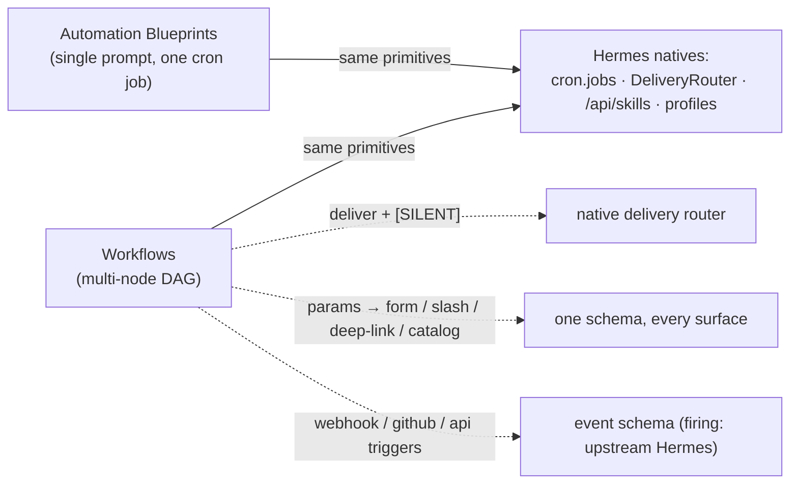

## Summary

Make Hermes Workflows native and correct against Hermes after **Automation Blueprints** shipped.
Workflows are the multi-node tier above the single-prompt blueprint tier; this PR aligns them on the
same primitives and conventions. It ships the **in-repo native layer** of the alignment epic
(`t_5a9b2502`): a workflow can declare where its result is delivered (and stay silent), pick skills
from the host catalog, carry typed template parameters that render across surfaces, and declare
event triggers — all on Hermes-native primitives, with the two host-gated pieces shipped to their
real boundary and no stubs.

## Why this matters

Workflows stop being a parallel island: they deliver, gather skills, parameterize, and trigger the
same way blueprints do, so a user moving between the two tiers sees one consistent model.

## What ships

| Area | Change | Child |
| --- | --- | --- |
| Delivery | `Workflow.deliver` (DeliveryTarget syntax or `origin`); a completed run delivers its result via the native router; `[SILENT]` suppresses; unchanged when unset | `t_13d09914` |
| Skills | Node-inspector multi-select backed by host `/api/skills`, preserving uncatalogued values | `t_6d2d4811` |
| Templates | `templates/params.ts` (typed params + pure emitters: form / `/workflow` slash / `hermes://` deep-link / catalog / agent-seed + `fillParams`); `params` schema field; compile-preview `catalog` | `t_959ae539` (native layer) |
| Triggers | `webhook` / `github` / `api` event triggers with an `events` filter + `{event.*}` mapping; parsed, validated, previewed | `t_d7809a7a` (native layer) |
| Positioning | README Workflows-vs-Blueprints section; Schedules rows tagged `Workflow` | `t_d468bc7e` |

**Host-gated (no stub, deferred upstream):** the host webhook system dispatches events only to agent
prompts / direct delivery (no event→workflow-run wiring; `create_job` is time-only), and there is no
host `/workflow` slash handler or `hermes://` workflow resolver. So event-trigger **firing** and the
**live** slash/deep-link surfaces wait on an upstream Hermes change; this PR ships the real,
tested schema + pure emitters those surfaces consume, not a fake that pretends to fire.

## Test plan

- [x] `bun run typecheck` · `bun run lint` (0 errors)
- [x] `bun test packages/core` — schema/serialize/validation/compiler + new `delivery`, `params`, `triggers` suites
- [x] `python3 -m pytest` — `test_engine_delivery`, `test_notifications` (deliver precedence + `[SILENT]`), regressions
- [x] `bun run dashboard:test` — node-inspector skills multi-select, compile-preview catalog, schedules tag
- [x] `bun run dashboard:build` + dist guard (`git diff --exit-code dashboard/dist`)
- [x] Independent self-review vs `main` (fresh-context reviewer): passed, no security/logic findings

Built via the feature-release-playbook (brainstorm → spec → TDD per feature → self-review → QA →
docs). Release phase intentionally skipped (no versioned release yet).
